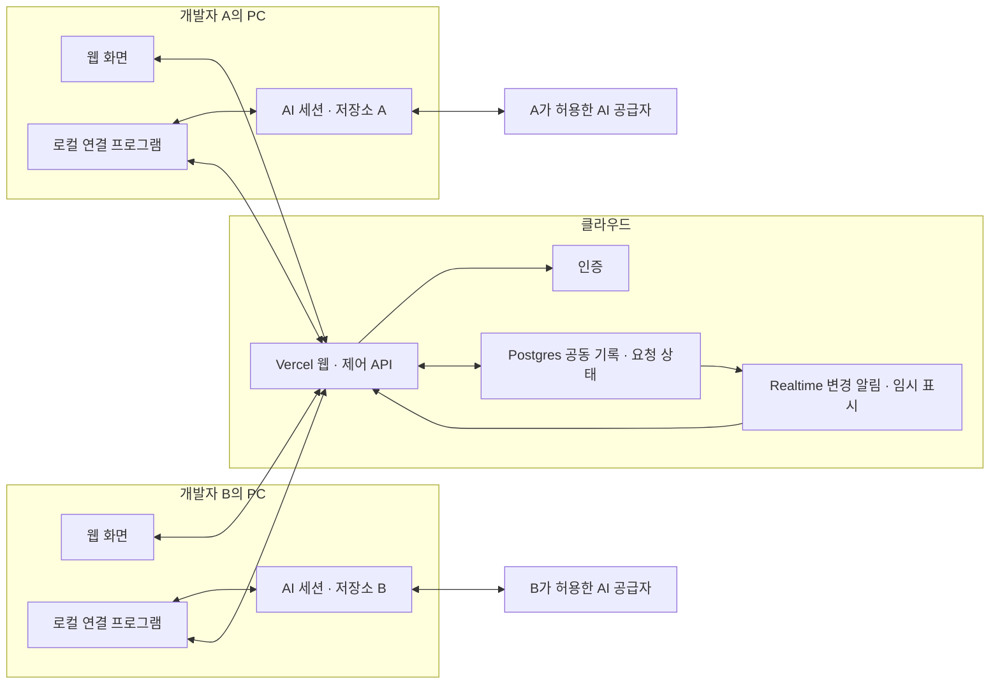

# 아키텍처

이 문서는 전체 제품 설계와 현재 소스의 시스템 경계를 설명한다. 독립 런타임 실험·모의 웹, 사람 인증·방 접근, 기기 등록, 내구 조사 조정과 로컬 Codex 실행기, 소유자 웹 설정과 PC 설정 관리 소스가 있다. 공개 등록의 `unverified` 표시는 유지한다. 현재 진행 상태·검증 수치·남은 통합은 [개발 순서와 검증 계획](planning/delivery-and-validation.md#현재-진행-상태)을 따른다. 검증 기준은 위 커밋의 소스이며 이후 수정은 `git diff HEAD -- <sources>`로 함께 확인한다.

제품 범위는 [PRD](PRD.md), 실행·복구 불변식은 [비즈니스 로직](BUSINESS-LOGIC.md)이 정본이다. 확정된 중요한 결정의 이유는 [ADR](ADR.md), 미선택 기술안과 대안은 [미결 선택](planning/decisions-and-open-items.md#검토-중인-기술-선택)을 따른다.

루트 Next.js 웹은 `experiments/local-ai-runtime/`의 독립 TypeScript 실험을 import하거나 실행하지 않는다. 실제 웹 route·state·검사 범위는 [FRONTEND-ARCHITECTURE](FRONTEND-ARCHITECTURE.md), 중앙 모델과 HTTP 계약은 [DB-SCHEMA](DB-SCHEMA.md)·[API-SPEC](API-SPEC.md), 공급자 실험 증거는 [로컬 AI 연결 조사](research/local-ai-connection-research.md#이번에-실제-확인한-로컬-증거)를 따른다. 그림의 Realtime와 두 PC의 실제 provider 연결은 후속 수용 범위다.

## 웹 입장과 대화의 구현 경계

실제 웹은 회사 코드·표시 이름 입장과 AI 채팅방 목록을 기본 진입으로 사용한다. shadcn/ui·Tailwind가 화면 구성과 접근 가능한 Dialog·Sheet를 제공한다. 모의 체험은 `/demo`에 둔다. `ChatShell`은 탐색·배치만 맡는다. `RoomChatController`가 공개 이력·조회·요청·미확정 저장과 취소를 소유하고, `useRoomChat`이 React의 구독과 화면 수명에 연결한다. `InvestigationView`는 입력 초안·대상과 epoch 선택·스크롤을 소유한다. 표시용 Timeline·Composer·고급 제어에 별도 HTTP·storage·polling을 만들지 않는다.

웹은 현재 사용자 session과 publishable key로 DB를 호출한다. 입장 코드 verifier·admission·시도 제한은 private DB 모델이 소유하며 제품 웹에 admin key·DB 비밀번호를 주지 않는다. 웹의 `runtime-settings`는 자기 기기에 폴더 선택·공급자·모델·추론 강도(`effort`) 설정 요청을 저장한다. PC의 `SettingsManager`가 native 폴더 선택과 자동 코드 탐색 범위의 확인, 준비와 적용을 맡는다. 웹 요청 접수·서버 확정·PC 적용을 별도 상태로 표시하며, 이 소스 구현을 실제 Mac·DB·공급자 수용 완료로 해석하지 않는다. [프런트엔드](FRONTEND-ARCHITECTURE.md)·[입장 DB](DB-SCHEMA.md#회사-코드-입장)

## 설치 없이 명령 한 번으로 연결

`ConnectionsPage`는 검증한 서비스 주소·현재 사용자·승인 가능한 방을 화면에 전달한다. `LocalConnectionGuide`가 방과 기기 이름에 맞는 명령을 만들고, `ConnectionManager`는 URL fragment의 기기 코드를 한 번 읽어 지운다. 코드 입력과 웹 승인은 별개이며 확인란을 자동 선택하지 않는다.

운영 연결 코드는 `build-local-connection.mjs`가 새 임시 폴더에서 컴파일한다. 테스트·개인 파일·외부 런타임 패키지를 제외한 압축 파일과 검증값이 `public/local-connection/`에 생성된다. 웹 개발·빌드 전에 생성하며 `dev-local-web.mjs --check`는 생성하지 않는다. 파일의 검증값을 이름에 포함하고, 모든 파일이 준비된 뒤 배포 정보를 교체한다.

Mac의 임시 실행 코드는 다운로드 검증·실행 환경 검사만 맡는다. 기존 Node 24를 사용하거나 공식 고정 버전을 임시로 실행한다. `connect-command`가 기존 `Connector` 등록·복구와 터미널의 소유 계정·방 확인을 연결한다. 등록 준비 잠금을 반환한 뒤 기존 `SettingsManager`가 실행을 관리한다. 웹 설정·중앙 API·공급자 권한·읽기 도구 계약은 그대로 사용한다.

연결 프로필은 서비스 주소·사용자·방으로 구분한다. 재접속은 같은 프로필을 사용하고 불확실한 등록을 새 프로필이나 AI 입력으로 재시도하지 않는다. 종료 신호를 연결기에 전달하며 소유 프로세스 종료가 확인된 경우에만 이번 임시 실행 파일을 제거한다. 개인 로그인·설정·대화 기록은 제거하지 않는다. 실제 공급자·두 PC 수용과 배포 상태는 [개발·검증 상태](planning/delivery-and-validation.md#현재-진행-상태)에서 확인한다.

## 추천 구조

두 PC의 연결은 outbound HTTPS/실시간 연결이다. 외부에서 PC로 접속하기 위한 공개 포트나 원격 셸을 두지 않는다. 저장소 파일과 공급자 인증은 로컬에서 다루고, 승인된 공유 정보가 클라우드를 통과한다.

그림은 양쪽 AI를 연결한 공동 조사 예시다. 사람→상대 AI의 직접 질문에서는 질문자 쪽 로컬 연결 프로그램·AI·저장소가 선택 사항이다. 질문자 웹→중앙 API/DB→대상 로컬 연결→AI→같은 질문의 답변 순서로 동작한다. [010](impl-spec/archive/010-human-direct-questions.md)은 기존 두 AI의 시작 계약을 유지하고 별도 DIRECT cycle에 사람 발신자와 대상 실행 하나를 기록한다. 구현 검증과 후속 연동은 [진행 상태](planning/delivery-and-validation.md#현재-진행-상태)를 따른다. [직접 질문 규칙](BUSINESS-LOGIC.md#사람이-상대-ai에-직접-질문하는-흐름)

‘AI를 로컬에서 실행’은 도구·저장소를 다루는 agent 프로세스가 PC에 있다는 뜻이다. 일반 Codex/Claude 연동의 모델 호출은 해당 공급자 서비스로 나가며 필요한 입력이 공급자에게 전달된다. 모든 추론과 코드 처리가 PC 안에서만 끝나는 구조로 표현하지 않는다.

현재 구현은 Next.js/TypeScript 웹·제어 API, Node.js 24/TypeScript 로컬 연결 프로그램과 Supabase Auth/Postgres를 사용한다. 로컬 Codex 실행기는 같은 중앙 계약의 소유 맥락·저널·복구를 제공한다. Claude의 기본 생성 경로는 해당 Mac의 공식 native 설치·로그인·설정을 검증하는 정책을 사용한다. 지원 범위 밖이거나 검증되지 않은 조합은 `POLICY_UNCONFIRMED`로 실행을 차단한다. Realtime·실제 Claude 수용·배포 상태는 개발 순서 문서를 따른다. 개인·비상업용 초기 배포는 Vercel Hobby + Supabase Free를 기준으로 한다. 조사 대상 저장소의 프레임워크·DB·업무 모델을 제품의 필수 의존성으로 삼지 않는다. 선택의 이유는 [ADR-002](ADR.md#adr-002--첫-구현의-언어와-중앙로컬-경계)에 기록한다.

방·질문·근거·AI binding은 업무 도메인과 독립된 협업 모델이다. API 연동 외에 변경 영향이나 다른 공동 문제도 목표와 근거를 입력해 조사한다. 특정 서비스의 업무 테이블·판매 채널 ID·전용 처리 흐름을 핵심 모듈에 내장하지 않는다.

Vercel은 화면과 짧은 제어 API를 제공하고 AI 실행·지속 연결을 위한 상시 프로세스를 맡지 않는다. 실시간 연결은 Supabase가 담당하며 출력 미리보기는 묶어서 전송하고 최종 메시지·필수 상태만 영속화한다. 무료 한도를 위해 권한 검사·중단 제어·확정 기록의 내구성을 줄이지 않는다. 구체적인 한도와 운영 제안은 [무료 플랜 운영 기준](guides/constraints-and-security.md#무료-플랜-운영-기준)에 둔다.

## 모듈 책임

| 모듈 | 책임 | 작은 외부 표면 |
|---|---|---|
| 공동 조사 | 방·참가자·질문·답변·결과, 현재 revision과 순서 관리 | 요청 제출, 답변 제출, 제어, 이후 이벤트 조회 |
| 로컬 실행 | 저장소 선택, 실행 권한, 세션 소유, 입력 큐·로컬 저널, 결과 공유 | 연결 등록, 요청 처리, 개입, 상태 보고 |
| AI 런타임 연동 | 공급자별 세션·이벤트·중단·승인 차이 처리 | 세션 열기, 실행, 이벤트 구독, 개입 |
| 정보 공유 | 공개 범위, 크기 제한, 발췌·출처, 비밀 제외 | 공유 산출물 준비·승인 |
| 개인 설명 | 공동 기록 snapshot 기반 별도 문맥의 설명 | 설명 요청, 공개 전환 |
| 웹 화면 | 공동/개인 표시, 동작 상태, 사용자 제어 | 읽기·입력·상태 동기화 |

로컬 실행 모듈 안에서 공급자별 구현을 바꾼다. 중앙 API가 임의의 셸 문자열을 실행하는 인터페이스를 제공하지 않는다. API·DB·UI가 공급자의 raw event 형식에 직접 의존하지 않도록 제품 이벤트로 정규화한다.

## 저장과 실시간 표시

현재 `investigation-coordinator`는 사람 cookie 제어와 device bearer 실행 보고를 별도 고정 API로 제공한다. DB transaction이 질문·수신 run·공유 답변·유일 origin continuation을 연결하고 revision·양쪽 epoch·lease/fence·한도를 재검사한다. 웹은 공개 event를 cursor로 재조회한다. 007의 `WorkflowRunner`는 같은 `WorkflowClient`를 사용해 로컬 intent·ACK·typed terminal·업로드 receipt를 연결한다. 가짜 adapter의 통과와 실제 provider 수용을 구분하며 기존 중앙 DTO/SQL을 바꾸지 않는다.

같은 feature의 브라우저 코드에서는 `InvestigationView`가 공동 이력 조회·직접 질문 전송·미확정 질문의 저장/삭제·대상 선택을 소유한다. 본인 새 답변 제어는 `OwnInputControls`가 별도 상태와 intent를 소유한다. 상태가 없는 `investigation-client`는 공통 HTTP 응답 정책을, `direct-intents`와 `own-input-control-state`는 각 요청의 복원·검증 정책을 제공한다. 상세 책임은 [프런트엔드 모듈 경계](FRONTEND-ARCHITECTURE.md#상태-소유권과-입력)를 따른다.

본인 새 답변 제어의 정본은 `own_input_private.states`의 desired 상태이며 연결 프로그램의 `InputAdmission`은 현재 revision/epoch의 조회·적용 보고로 새 claim 허용만 관리한다. 기존 실행의 도구 admission·lease·native ACK·종결과 분리한다. 최초 성공 claim commit 이후의 답변은 일시정지로 중단하지 않는다. 확정 거절은 공통 workflow receipt에 저장하고 정확한 미시작 proof와 원래 claim CLOSED를 로컬의 한 저장에서 확정한다. timeout과 저장 실패는 UNKNOWN으로 보존한다. [제어 계약](API-SPEC.md#내-ai의-새-답변-제어)·[저장 경계](DB-SCHEMA.md#본인-ai의-새-답변-상태)·[검증 정본](planning/delivery-and-validation.md#현재-진행-상태)을 따른다.

- Postgres: 확정 메시지, 질문 상태, 실행 요청·상태, 방 revision, 참가자 권한, 명시적 개입, 근거·결론의 정본.
- Realtime: 새 이벤트 알림, 온라인 표시, 작성 중 delta의 빠른 표시. 전달 완료나 실행 완료의 증명이 아니다.
- 로컬 저널: 요청 수신·실행 시작 의도·runtime turn ID·종결 결과·업로드 대기. 오프라인·프로세스 장애 복구에 사용한다.
- 파일 저장소: 큰 공유 로그·파일의 승인된 발췌. MVP에서 텍스트 크기 제한으로 충분하면 생략한다.

실시간 토큰마다 DB에 쓰지 않는다. 작성 중 표시는 묶어서 전송하고, 확정 메시지는 영속 저장한다. 표시가 유실돼도 확정 기록을 조회해 복원할 수 있다.

## 개념 데이터 모델

| 엔터티 | 주요 관계와 불변식 |
|---|---|
| Organization / Membership | 서비스 그룹과 사람의 접근. MVP는 두 사용자의 한 그룹을 지원하되 그룹 밖 접근을 차단한다 |
| Room / RoomMember | 문제·목표·현재 revision·상태·참가자. 제어 권한의 기준 |
| InvestigationCycle | 공동 조사 하나의 자동 진행 한도·누적 사용량·deadline. 개별 질문/turn과 분리 |
| Device / WorkspaceBinding / AgentBinding | 기기·소유자·등록 저장소·방·runtime session·연결 수준·bindingEpoch. 경로와 세션을 별도로 확인하고 한 AI의 실행 소유권 관리 |
| SharedEvent / SharedMessage | 방별 순서, 발신자 종류, 출처, replyTo, revision. 확정 기록은 수정 대신 정정 이벤트를 남긴다 |
| PeerQuestion | 질문·수신 AI·상태·기한·답변 관계. 질문 하나의 응답 여부를 관리한다 |
| RunRequest / RunAttempt | 멱등 키, 입력 snapshot, 권한 scope, epoch, lease/fence, runtime turn ID, 불확실한 실행 상태 |
| Intervention | 자기 AI 방향 수정, 방 일시정지, 승인. 실제 발신자와 적용 상태 기록 |
| Evidence / Artifact | 저장소·commit·dirty snapshot, 코드 위치, 실행 결과, 공유 범위 |
| PrivateConversation | 소유자만 접근하는 설명 대화. 공동 기록·runtime 문맥과 분리 |

초기 구현에서 실제 테이블 수·컬럼·인덱스는 검증 결과에 맞춰 줄일 수 있다. 위 개념을 하나의 메시지 테이블에 모두 섞어 권한과 실행 상태를 표현하지 않는다.

방별 이벤트 순서는 트랜잭션 안에서 방 카운터 증가와 이벤트 삽입을 함께 수행한다. 일반 DB sequence의 증가값만으로 같은 방의 commit 순서까지 보장한다고 가정하지 않는다. `roomRevision`은 공동 목표·방 제어의 버전, `bindingEpoch`는 특정 AI의 실행 방향 버전, `eventSequence`는 기록 순서이므로 별도로 둔다.

브라우저 경로 입력만으로 PC의 CLI를 실행하지 않는다. 로컬 connector 등록과 공급자별 연결 인터페이스·검증 증거는 [로컬 AI 연결 조사](research/local-ai-connection-research.md)에 둔다.

## 저장소와 AI의 최초 등록

등록과 화면 순서는 [최초 접속 흐름](guides/onboarding-and-settings.md#최초-접속-흐름)이 정본이다. 구조상 웹 로그인으로 확인한 사람, 로컬 root를 확인한 `WorkspaceBinding`, 조사방에서 선택한 `AgentBinding`을 분리한다. 등록 root와 session cwd가 일치하고 방의 binding이 확정된 뒤에만 질문을 실행한다. 같은 저장소의 다른 worktree·branch·session은 별도 연결로 취급한다.

실행 중 저장소/session을 바꾸면 해당 binding을 멈추고 새 epoch와 snapshot으로 다시 연결한다. 외부 앱의 branch 변경·파일 편집은 drift로 감지하고 기존 근거를 현재 코드라고 표시하지 않는다.

## 인증·기기 연결

웹 요청의 공통 본문 읽기는 내부 `src/lib/http/read-json-body.ts`가 담당한다. Origin 비교·JSON content type·실제 수신 바이트 16KiB 상한·스트림 정리·decode/parse를 한 곳에서 처리한다. 방 접근·기기·조사 정책은 각 도메인의 필드 검증과 오류 클래스를 유지하며, 기기 bearer 요청에서는 브라우저 Origin 설정을 읽지 않는다. 방 접근·조사는 엄격한 UTF-8 해석을, 기기는 기존 대체 문자 해석을 유지한다. 공개 입력과 오류 계약은 [API-SPEC](API-SPEC.md), 검증 상태는 [진행 정본](planning/delivery-and-validation.md#현재-진행-상태)을 따른다.

기기는 짧은 만료시간의 일회용 pairing code로 로그인한 소유자에게 연결한다. 발급 토큰은 소유자·조직·방·연결 범위로 제한하고 갱신·취소·기기 제거를 지원한다. 공급자 로그인 토큰/API 키와 중앙 관리자 키를 pairing token으로 사용하지 않는다. 사용자 단계는 [첫 사용 설정](guides/onboarding-and-settings.md), 신뢰·키 경계는 [인증·Realtime·서버 키](guides/constraints-and-security.md#인증realtime서버-키)를 따른다.

현재 기기 인증은 사람 JWT와 분리한 opaque bearer다. 일회용 code와 로컬 proof는 서로 다른 256-bit 난수이며 승인 유효 기간은 5분, 기기 credential은 1시간이다. 공개 RPC는 원문 bearer를 hash해 저장 hash와 대조하고 현재 사람·조직·방·기기 scope를 다시 검사한다. 교환/회전/등록/교체는 로컬 선기록과 제한된 동일-operation receipt로 응답 유실을 복구한다. 권한 취소 뒤 재초대해도 옛 연결을 되살리지 않는다.

`packages/local-connector/`는 macOS·Node 24 CLI다. canonical root와 native session mapping은 0700/0600 private state에, 사용자 별칭·Git metadata만 중앙에 둔다. v1 profile과 별도로 binding별 설정·소유 맥락·실행/outbox 저널을 저장하며 짧은 credential 잠금과 실행/session 잠금을 분리한다. 기존 등록 locator만으로 실행을 허용하지 않는다. 공식 Codex stdio child의 소유권·모델·선택 파일을 검증하고 개인·프로젝트 지침과 설정 파일을 유지한다. 공동 조사에서는 읽기 전용 native 권한과 일시적인 기능 제한으로 미검증 MCP/plugin/hook 실행을 막는다. 기존 v1 Codex profile은 유지하며 설정 경로의 공개 runtime은 `codex` 또는 `claude`, 연결 표시는 `registered/unverified`다. 등록과 PC 설정 적용을 provider 실행 검증으로 표시하지 않는다. 로컬 명령은 [온보딩](guides/onboarding-and-settings.md#로컬-codex-실행-준비), 참가자별 설정의 배경은 [실행 설정](research/ai-runtime-integration.md#참가자별-도구모델effort-선택)을 따른다.

`manage --profile <profile>`는 기기별 설정 잠금을 잡고 같은 기기의 outbound 조회·설정과 runner 수명을 관리한다. 서버에는 공개 별칭·설정·불투명 root 참조만 저장하고 실제 root·선택 파일·native session은 PC에 둔다. `SettingsStore`는 후보와 현재 설정 generation, 적용 저널을 private state에 보관한다. 서버의 `COMMITTED` receipt를 확인한 뒤 generation 기록·profile mapping·현재 pointer를 영속 저장하고 `APPLIED`를 보고한다. 재시작 때 pointer 값이 같아도 최종 저장을 다시 수행해 이전 rename·디렉터리 동기화 실패 뒤 영속성을 확인한다. 이전 generation의 이력·outbox는 보존하고 새 root/provider로 옮겨 재개하지 않는다. 서버 예약, PC 준비, 서버 확정과 로컬 확정은 하나의 원자적 작업이 아니므로 같은 operation의 증거로 복구한다. [설정 규칙](BUSINESS-LOGIC.md#소유자의-로컬-ai-설정)·[설정 계약](API-SPEC.md#소유자의-로컬-ai-설정)·[검증 정본](planning/delivery-and-validation.md#현재-진행-상태)을 따른다.

공통 `provider-adapter.ts`가 설정 관리·현재 설정 실행·단독 모델 목록 조회·기존 Codex 실행의 공급자 생성을 담당한다. Claude의 `configuration.ts`는 적용 설정의 안전한 읽기와 변경 확인을 담당한다. 기본 `native-policy.ts`는 `native-installation.ts`의 공식 설치·게시자·로그인 검증과 `native-sources.ts`의 설정·지침 발견을 조합해 실행 인자·환경·정확한 소유 이력 경로를 제공한다. 기존 `launch-policy.ts`는 Node 합성 fixture 전용으로 유지하며 그 근거로 공식 Claude 실행 파일을 허용하지 않는다. 개인 설정 파일은 수정하지 않고 작업별로 읽기 전용 도구·훅·플러그인 제한을 적용한다. 초기 지원 범위와 입력 없는 점검 절차는 [Claude 연결 확인](guides/onboarding-and-settings.md#claude-연결-확인)을 따른다.

공식 실행 파일의 hash는 고정 크기 descriptor 읽기로 계산하고 identity가 같으면 재사용한다. 지침의 import 목록도 변경 없는 source에서 재사용하되 파일 identity·새 source·실행 권한 변화는 계속 검사한다. native global 설정은 계정·조직과 실행 권한을 고정하고 Claude가 갱신하는 시작 횟수·캐시는 권한 변화와 구분한다. `feedbackSurveyState`는 음수가 아닌 안전한 정수 `lastShownTime` 하나만 가진 경우에 한해 설문 표시 시각으로 구분한다. 알 수 없는 필드·잘못된 형식·계정·조직·권한 변경은 계속 실행을 차단하며 개인 파일은 수정하지 않는다.

단독 모델 목록 조회의 `catalog-store.ts`는 기기 프로필에 소유 세션 예약을 먼저 내구 저장한다. 같은 프로필의 새 준비·목록 조회·실행과 Codex 전환은 미확인 정리가 남으면 차단한다. catalog 디렉터리 밖의 고정 identity 파일로 이력 파일이나 디렉터리의 이동·교체도 확인한다. 실제 소유 실행 프로세스의 종료 확인만 예약을 닫으며, 파일만 읽는 Claude의 소유 이력 관찰은 계속 허용한다. 설정 관리자의 기존 generation 예약 저널과 023 중단 증거 계약은 유지한다. 실제 검증 범위는 [진행 정본](planning/delivery-and-validation.md#현재-진행-상태)을 따른다.

Claude 읽기 도구 중단은 입력·도구·control ID와 payload·취소 프레임 해시를 실행 권한 확인 아래 로컬 저널에 동기화한다. 종료 이력에는 같은 증거를 보존한다. 기존 stream 형식의 이력 증명은 입력·초기화·typed 결과를 재검증한다. 공식 CLI의 native JSONL은 init/result가 없는 별도 형식이며 `native-history-proof.ts`가 세션·cwd·입력·부모 연결과 실시간 메시지·실제 도구 반환을 대조한다. 저장 assistant 본문만으로 UNKNOWN을 종결하지 않는다.

실시간 typed terminal과 소유 child 정리를 확인한 입력에만 native 이력 체크포인트를 만든다. 이력 대조에 실패해도 확인한 terminal을 버리지 않고 Claude 전용 `nativeHistory: UNVERIFIED`를 terminal과 owned turn에 함께 불변 저장한다. 답변 게시·동일 게시 재시도는 유지하며 다음 native 입력만 차단한다. VERIFIED는 이력 prefix 길이·hash를 보존하고 같은 UUID의 후속 질문과 보관 뒤 재접속에서 다시 검증한다. 기존 Codex/v1과 합성 Claude 기록의 형식은 유지한다.

도구 없는 Claude 중단도 전체 입력 descriptor와 고정 중단 요청의 해시를 로컬 저널에 fsync한 뒤 native control을 전송한다. 현재 소유 입력의 정리 증거 저장은 종료 중에도 허용하지만 일반 입력·도구·control 권한은 다시 열지 않는다. 종결 수신은 그때 이미 시작한 증거 저장만 기다린다. 미래 중단 응답은 기다리지 않으며 닫힌 입력을 변경하지 않는다. UNKNOWN 관찰과 보관 후 전체 이력 검증은 같은 불변 증거를 사용하고, 정상 완료가 우선이며 중단 증거 없는 typed abort는 UNKNOWN이다.

로컬 명령의 공개 진입점은 `cli.ts`의 `main`이다. 환경 검사·필수 옵션·객체 조립·명령 선택·JSON 출력은 이 진입점이 담당한다. 내부 `cli/parse-options.ts`는 기존 옵션 쌍의 해석과 오류를, `cli/remove-local-profile.ts`는 전체 profile 제거를 담당한다. 제거 모듈은 원래 store와 runner factory를 받아 모든 agent의 보호를 확보하고, 원래 transaction에서 전체 검증을 마친 뒤 삭제한다. 공개 명령과 bin 경로·잠금 소유자·기존 파일 검사와 정리 순서는 유지한다.

로컬 실행기의 제거 보호는 내부 `workflow/local-removal.ts`가 소유 정보와 저장 맥락의 검증, 파일 속성 확인·삭제, session 잠금 안의 callback을 담당한다. `WorkflowRunner`는 진입 검사·binding 잠금·같은 실행 권한과 추적 작업·종료 대기·퇴역 상태를 계속 소유한다. 공개 `guardLocalRemoval`과 `removeLocal`, CLI의 전체 profile 제거는 기존 proof 구조와 수명·오류 순서를 유지한다. 제거 모듈은 일반 실행·복구·공급자 종료를 맡지 않는다.

로컬 실행 기록의 파일 I/O·잠금·영속 저장·보관 전환은 `RuntimeStore`가 담당한다. 내부 `runtime/record-schema.ts`는 저장 형식을, `record-validation.ts`는 기록 안의 관계를, `record-transitions.ts`는 이전·다음 기록의 상태 전환을 검증한다. 공통 순수 판정은 `record-helpers.ts`에 두며 기존 공개 함수는 원래 `runtime-store.ts`에서 제공한다. 저장의 잠금 전 기본 검증과 잠금 뒤 상태 검증, 완료 기록의 별도 보관 전환 경로를 유지한다.

내부 `RuntimeArchive`는 완료된 요청의 원문 보관 파일을 검증한다. `WorkflowRunner`는 실행·파일 읽기·서버 응답 저장에 앞서 종결과 완료 전송 공간을 확보한다. 한 저장 안에서는 보관 원문·해석 결과를 재사용하고 이전·다음 기록과의 관계를 각각 검증한다. 내부 모듈이 열린 파일과 현재 경로를 검증 범위 전후에 재대조하고 정리하며, 저장이나 호출 사이에는 결과를 보관하지 않는다. 선택 파일 도구의 저장 예약은 검증한 snapshot의 바이트 크기로 계산하며 실제 읽기 권한·변경 감지는 기존 파일 정책이 계속 확인한다. 보관 증거는 새 실행 권한이나 새 저장 세션으로 사용하지 않는다. [보관·용량 규칙](research/ai-runtime-integration.md#로컬-실행-기록-보관과-용량)과 [현재 검증 상태](planning/delivery-and-validation.md#현재-진행-상태)를 따른다.

실행 권한의 ACK·도구 취소·중단 증거 콜백은 내부 `workflow/attempt-authority.ts`가 구성한다. 현재 기록, 직렬화한 변경, 활성 권한, 호출 목록과 용량 예약은 `WorkflowRunner`가 계속 소유한다. 내부 모듈은 이 소유자의 검사·저장 기능만 전달받으며 별도 실행 상태를 만들지 않는다. 실행과 시작 전 복구의 비공개 헬퍼는 입력 전 증거 저장과 서버 영수증 확인을 나눈다. 호출 순서와 대기 지점, monitor 중단·대기와 `finally`의 저장·호출·예약 정리를 유지한다.

파일 접근의 내부 모듈은 `workspace/safe-file-reader.ts`에서 root·조상·파일 descriptor의 식별자와 소유권·내용을 검사하고 열린 파일을 정리한다. 기존 `RuntimeFilePolicy`는 이를 사용하며 선택 파일의 승인·원문 반환·snapshot 비교를 유지한다. 새 `workspace/repository-reader.ts`의 `RepositoryReader`는 승인한 root의 목록·문자열 검색·UTF-8 바이트 발췌와 누적 탐색 예산을 담당한다. 자동 모드의 내용 검사는 `workspace/automatic-content-policy.ts`가 소유하며 quoted key·JWT를 전진 검사해 반복 문자열의 비용을 제한한다. 기존 선택 파일과 공개 문자열의 비밀 검사 패턴은 유지한다. 반환 코드에는 전체 파일 hash·읽은 시각·바이트 범위·발췌 hash를 연결하고 전체 줄 수는 검증한 원문에서 계산한다. 일반 인증·설정 구현 코드와 비밀 설정 자료를 구분한다. 자동 탐색 권한은 `workspace/repository-access.ts`가 새 설정 세대·등록 root·해당 Mac의 명시적 승인에 묶어 검증한다. `workspace/tool-contracts.ts`는 모드별 도구 정의·인자와 origin 역할 판별을 양 공급자에 제공한다. `workflow/repository-tools.ts`는 실행 한 번의 reader·호출 및 동시성 예산·반환 관찰·상대 질문의 사전 근거 검증을 맡는다. `WorkflowRunner`는 실행 권한·용량 예약·내구 저장·서버 발송 순서를 계속 소유한다. 기존 빈 선택 목록을 자동 탐색 승인으로 해석하지 않으며 입력 전 `SourceObservation v1`과 실제 읽기 자료는 서로 다른 관찰이다. 운영 연결과 중앙 코드 이력의 남은 범위는 [개발·검증 상태](planning/delivery-and-validation.md#다음-작업-순서)를 따른다.

자동 도구는 코드 I/O 전에 호출 의도를 저장하고 결과와 실제 반환 관찰을 함께 확정한 뒤 AI에 반환한다. 중단은 해당 호출의 권한을 닫고 이미 시작한 의도 저장만 기다린다. 늦은 읽기 결과와 UNKNOWN 복구는 새 읽기로 대체하지 않는다. 상대 질문의 근거 관찰은 정확한 발송 operation과 함께 먼저 저장하며 AI에 반환한 자료와 구분한다. 당시 세대의 완료 이력은 원래 승인·설정·증거 전체를 기존 보관 파일에 남긴 뒤 새 세대로 준비한다. 이 소스 동작의 독립 검토와 실제 수용 상태는 [개발·검증 정본](planning/delivery-and-validation.md#현재-진행-상태)을 따른다.

입력 당시의 저장소 관찰은 내부 `workflow/source-snapshot.ts`가 수집·검증·hash·크기 계산을 담당한다. 각 Git 조회 전후에 등록 root의 신원을 대조하고, native 입력 직전에 허용 파일 전체를 다시 검증한다. `WorkflowRunner`는 첫 claim 전 공간을 예약하고 `sourceObservation`을 원래 provider-intent와 함께 한 번 저장한다. claim이 새 입력 일시정지로 거절되면 정확한 미시작 attempt와 닫힌 claim이 소유 디스크에 저장·채택된 경우에만 해당 관찰 예약을 해제한다. 저장 전 실패와 다른 실행의 예약은 유지한다. 상대 경로·파일 hash·검증 시각과 해당 root를 포함하는 Git 저장소의 commit/ref만 관찰에 넣으며 dirty는 `unknown`이다. Git 조회 실패는 미확인이고 root·파일·실행 권한 실패는 입력을 거절한다. `RuntimeStore`는 최초 저장의 관찰 삽입과 나중의 변경·삭제를 거절한다. 기존 UNKNOWN·outbox·보관 원문은 당시 관찰을 유지하며 관찰이 없던 과거 기록은 현재 정보로 채우지 않는다.

중앙 채팅의 자료 기록은 로컬 저널에서 공개 허용 항목만 투영한다. 내부 [source-manifest.ts](../packages/local-connector/src/workflow/source-manifest.ts)는 원래 입력 관찰·도구 반환 발췌·상대 질문 전 근거를 구분하고 canonical bytes와 hash를 계산한다. [source-publisher.ts](../packages/local-connector/src/workflow/source-publisher.ts)는 같은 실행·전송 조각의 고정 ID, 부분 전송 재개와 전체 확정을 담당한다. [record-snapshot.ts](../packages/local-connector/src/workflow/record-snapshot.ts)는 외부 참조를 복제하고 기록의 하위 객체까지 동결한다. 저장 성공 뒤에는 저장에 전달한 동일 기록을 채택한다. [source-publication-guard.ts](../packages/local-connector/src/workflow/source-publication-guard.ts)는 그 불변 기록의 공개 투영을 재사용하며 전송의 각 경계에서 권한·저널·scope·attempt/fence를 확인한다. 기록 교체에는 원래 자료와 bytes/hash를 다시 비교한다. 전송기는 전체 확정을 먼저 조회하고 누락 조각만 생성한다. `WorkflowRunner`는 새 실행 전에 현재 연결의 자료 계약 지원을 확인하고, 새 완료·관찰 operation을 만들기 전에 같은 attempt/fence의 자료 전체를 확정한다. 전송 실패에는 원래 종결 기록을 유지하며 재시작 때 AI·Git·파일을 다시 실행하지 않는다. 이미 만든 operation과 자료 없는 과거 기록은 원래 본문으로 발행한다.

[자료 이력 migration 소스](../supabase/migrations/20261006001300-shared-input-source-history.sql)는 실행 요청을 예약할 때 대상의 공개 별칭과 연결 버전을 고정한다. 답변·종결·채택 이벤트에는 당시 실행의 확정 자료만 연결하며 공동 AI 질문에는 예약한 수신 대상을 연결한다. 조회는 event ID로 고정하고 과거 이력을 현재 binding이나 최신 attempt로 보강하지 않는다. 절대 경로·설정·native ID·파일 본문과 로컬 승인 객체는 전송하지 않는다. 공개 경로·hash와 반환 범위는 [자료 계약](API-SPEC.md#채팅의-당시-대상과-자료-기록)을 따른다. 화면 연결과 실제 SQL·HTTP·브라우저 수용의 진행 상태는 [검증 정본](planning/delivery-and-validation.md#현재-진행-상태)에 유지한다.

진행 중인 새 입력 제어 조회·ACK는 현재 connector와 binding/맥락의 권한을 검증한다. 이전 답변의 정상 완료로 monitor가 끝나도 이미 시작한 제어 조회는 같은 scope·generation에서 마친다. 실제 stop·연결 권한 상실·맥락 교체는 계속 거절한다. native 실행과 lease의 권한 검사는 원래 실행 monitor가 유지한다. 제어 ACK는 다음 claim이나 native 입력의 성공 증거가 아니다.

`experiments/claude-code-runtime/`의 합성 실행기는 제품 연결기와 분리한다. `NativeRuntime`이 입력·예산·선택 파일·입출력·정리를 소유하고, 내부 `NativeInputProof`는 입력 하나의 신원·ACK·도구 연결·실제 응답 완료·종결 검증만 소유한다. 입력 증명은 파일·프로세스·타이머·예산을 만들지 않는다. 재개 전에는 관찰한 소유 이력과 저장된 전체 기록의 순서·개수·hash를 대조한다. 기존 transport와 잠금·저장 형식은 유지하며 합성 검사로 실제 Claude 실행 허가나 제품 등록을 만들지 않는다. 실제 실행의 제한과 검증 범위는 [실험 설명](../experiments/claude-code-runtime/README.md)과 [진행 정본](planning/delivery-and-validation.md#현재-진행-상태)을 따른다.

opaque device bearer를 Supabase Realtime JWT로 사용할 수 있다고 가정하지 않는다. Realtime 인증과 사람 HttpOnly cookie의 연결은 후속 단계에서 검증하며 중앙 signing/admin key를 로컬 앱에 배포하지 않는다. 현재 등록 프로그램은 고정 HTTP API만 사용한다.

현재 브라우저에도 session JWT를 읽는 경로가 없다. 후속 전달 후보는 사람 cookie/기기 bearer로 인증한 durable 조회와 서버 내부 JWT를 사용하는 제한된 Realtime 알림 중계다. 위 그림의 Realtime→웹 연결은 아직 구현하지 않았다. 변경 알림은 공개 hint만 전달하고 정본을 재조회하며, 열린 연결의 권한 취소·만료·cookie 갱신과 종료를 실제 검증한다. 공식/설치 소스 조사 범위는 [S19](research/sources.md#s19)를 따른다.

공유 binding ID는 서버의 opaque 식별자이고 공급자 native session ID·절대 경로는 로컬 매핑에 둔다. 원래 session 제목을 자동 공유하지 않고 사용자가 확인한 별칭을 쓴다.

## Vercel 선택

현재 Vercel은 native WebSocket을 베타로 지원한다. 최대 Function 실행시간에 연결이 끝나며 재연결은 다른 인스턴스로 갈 수 있으므로 외부 상태·조율 저장소가 필요하다. [공식 근거](research/sources.md#s1)

| 선택 | 장점 | 부담 | 권고 |
|---|---|---|---|
| Vercel 웹/API + Supabase | 인증·관계형 기록·실시간 알림을 한 서비스군으로 구성 | RLS와 기기 권한, 재접속 복구를 정확히 구현 | 첫 개인·비상업 MVP 후보 |
| Vercel native WS + Postgres/Redis | 프로토콜·fan-out 직접 제어 | 베타·연결 수명, 외부 pub/sub, 인스턴스 경합 관리 | 특수 요구가 실측되면 검토 |
| Vercel 웹 + 상시 Node 중계 서버 | 긴 연결·서버 실행을 직접 운영 | 별도 서버·장애·배포·모니터링 운영 | 기존 운영 기반이 있으면 후보 |
| PC 간 직접 연결 | 중계 서비스 의존 감소 | NAT/VPN·접속 복구·공동 기록·접근 통제 부담 | 초기 권고에서 제외 |

Vercel의 `*.vercel.app` 주소는 회사 내부망을 의미하지 않는다. 별도 도메인 없이 시연할 수 있지만 앱 로그인·방 권한이 필요하다. 회사 업무용 플랜 적격성도 확인한다. [공식 근거](research/sources.md#s2)

## 운영 경계

- 웹 API는 짧은 DB 제어 작업만 수행하고 로컬 AI 실행을 기다리며 열린 Function을 유지하지 않는다.
- 연결 프로그램이 꺼진 PC의 요청은 대기·만료·사람 개입 상태로 남는다. 다른 기기가 조용히 대신 실행하지 않는다.
- 웹·기기·runtime 버전은 독립 식별하고 프로토콜 호환 여부를 handshake에서 확인한다.
- 중앙 감사 기록과 로컬 원본 로그의 보관·삭제는 별도 정책이다.
- 개발·시연·실제 사내 사용 환경을 분리한다. 회사 데이터 투입은 정보 공유 정책과 접근 검증을 완료한 뒤 진행한다.
