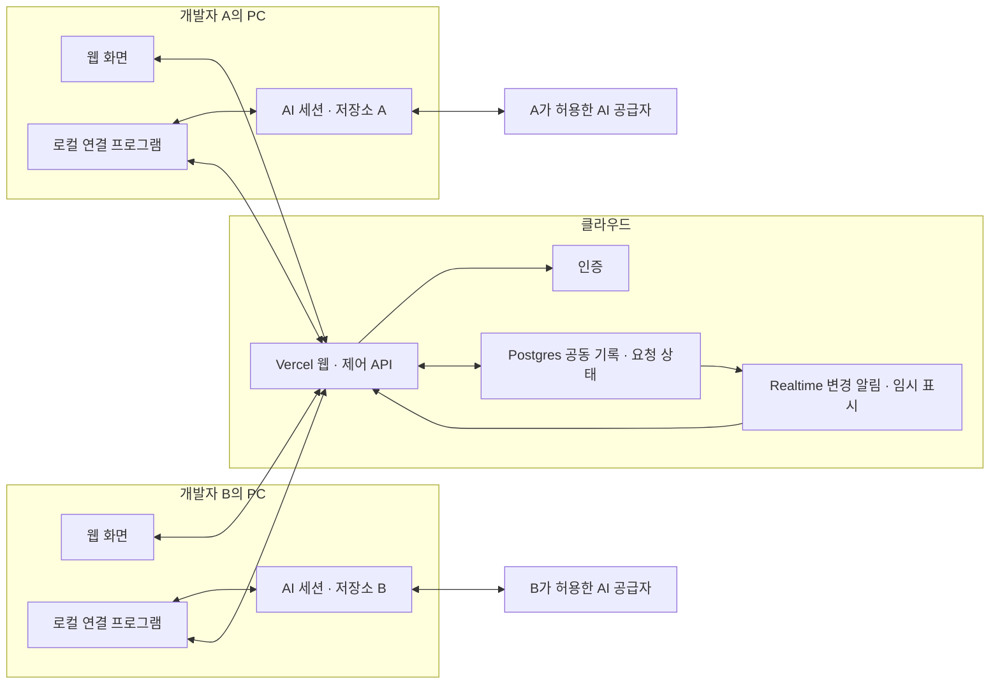

# 아키텍처

이 문서는 전체 제품 설계와 현재 소스의 시스템 경계를 설명한다. 2026-10-02의 Git 기준 및 작업트리를 확인했다. 독립 런타임 실험·모의 웹, 사람 인증·방 접근, 기기 등록, 내구 조사 조정과 로컬 Codex 실행기가 있다. 공개 등록의 `unverified` 표시는 유지한다. 현재 진행 상태·검증 수치·남은 통합은 [개발 순서와 검증 계획](delivery-and-validation.md#현재-진행-상태)을 따른다. freshness stamp는 Git 기준이며 미커밋 소스는 `git diff HEAD -- <sources>`로 함께 확인한다.

제품 범위는 [PRD](PRD.md), 실행·복구 불변식은 [비즈니스 로직](BUSINESS-LOGIC.md)이 정본이다. 확정된 중요한 결정의 이유는 [ADR](ADR.md), 미선택 기술안과 대안은 [미결 선택](decisions-and-open-items.md#검토-중인-기술-선택)을 따른다.

루트 Next.js 웹은 `experiments/local-ai-runtime/`의 독립 TypeScript 실험을 import하거나 실행하지 않는다. 실제 웹 route·state·검사 범위는 [FRONTEND-ARCHITECTURE](FRONTEND-ARCHITECTURE.md), 중앙 모델과 HTTP 계약은 [DB-SCHEMA](DB-SCHEMA.md)·[API-SPEC](API-SPEC.md), 공급자 실험 증거는 [로컬 AI 연결 조사](local-ai-connection-research.md#이번에-실제-확인한-로컬-증거)를 따른다. 그림의 Realtime와 두 PC의 실제 provider 연결은 후속 수용 범위다.

## 추천 구조

두 PC의 연결은 outbound HTTPS/실시간 연결이다. 외부에서 PC로 접속하기 위한 공개 포트나 원격 셸을 두지 않는다. 저장소 파일과 공급자 인증은 로컬에서 다루고, 승인된 공유 정보가 클라우드를 통과한다.

그림은 양쪽 AI를 연결한 공동 조사 예시다. 사람→상대 AI의 직접 질문에서는 질문자 쪽 로컬 연결 프로그램·AI·저장소가 선택 사항이다. 질문자 웹→중앙 API/DB→대상 로컬 연결→AI→같은 질문의 답변 순서로 동작한다. [010](impl-spec/archive/010-human-direct-questions.md)은 기존 두 AI의 시작 계약을 유지하고 별도 DIRECT cycle에 사람 발신자와 대상 실행 하나를 기록한다. 구현 검증과 후속 연동은 [진행 상태](delivery-and-validation.md#현재-진행-상태)를 따른다. [직접 질문 규칙](BUSINESS-LOGIC.md#사람이-상대-ai에-직접-질문하는-흐름)

‘AI를 로컬에서 실행’은 도구·저장소를 다루는 agent 프로세스가 PC에 있다는 뜻이다. 일반 Codex/Claude 연동의 모델 호출은 해당 공급자 서비스로 나가며 필요한 입력이 공급자에게 전달된다. 모든 추론과 코드 처리가 PC 안에서만 끝나는 구조로 표현하지 않는다.

현재 구현은 Next.js/TypeScript 웹·제어 API, Node.js 24/TypeScript 로컬 연결 프로그램과 Supabase Auth/Postgres를 사용한다. 로컬 Codex 실행기는 같은 중앙 계약의 소유 맥락·저널·복구를 제공한다. Realtime·Claude 통합과 배포 상태는 개발 순서 문서를 따른다. 개인·비상업용 초기 배포는 Vercel Hobby + Supabase Free를 기준으로 한다. 조사 대상 저장소의 프레임워크·DB·업무 모델을 제품의 필수 의존성으로 삼지 않는다. 선택의 이유는 [ADR-002](ADR.md#adr-002--첫-구현의-언어와-중앙로컬-경계)에 기록한다.

방·질문·근거·AI binding은 업무 도메인과 독립된 협업 모델이다. API 연동 외에 변경 영향이나 다른 공동 문제도 목표와 근거를 입력해 조사한다. 특정 서비스의 업무 테이블·판매 채널 ID·전용 처리 흐름을 핵심 모듈에 내장하지 않는다.

Vercel은 화면과 짧은 제어 API를 제공하고 AI 실행·지속 연결을 위한 상시 프로세스를 맡지 않는다. 실시간 연결은 Supabase가 담당하며 출력 미리보기는 묶어서 전송하고 최종 메시지·필수 상태만 영속화한다. 무료 한도를 위해 권한 검사·중단 제어·확정 기록의 내구성을 줄이지 않는다. 구체적인 한도와 운영 제안은 [무료 플랜 운영 기준](constraints-and-security.md#무료-플랜-운영-기준)에 둔다.

## 모듈 책임

| 모듈 | 책임 | 작은 외부 표면 |
|---|---|---|
| 공동 조사 | 방·참가자·질문·답변·결과, 현재 revision과 순서 관리 | 요청 제출, 답변 제출, 제어, 이후 이벤트 조회 |
| 로컬 실행 | 저장소 선택, 실행 권한, 세션 소유, 입력 큐·로컬 저널, 결과 공유 | 연결 등록, 요청 처리, 개입, 상태 보고 |
| AI 런타임 연동 | 공급자별 세션·이벤트·중단·승인 차이 처리 | 세션 열기, 실행, 이벤트 구독, 개입 |
| 정보 공유 | 공개 범위, 크기 제한, 발췌·출처, 비밀 제외 | 공유 산출물 준비·승인 |
| 개인 설명 | 공동 기록 snapshot 기반 별도 문맥의 설명 | 설명 요청, 공개 전환 |
| 웹 화면 | 공동/개인 표시, 동작 상태, 사용자 제어 | 읽기·입력·상태 동기화 |

로컬 실행 모듈 안에서 공급자별 구현을 바꾼다. 중앙 API가 임의의 셸 문자열을 실행하는 인터페이스를 제공하지 않는다. API·DB·UI가 공급자의 raw event 형식에 직접 의존하지 않도록 제품 이벤트로 정규화한다.

## 저장과 실시간 표시

현재 `investigation-coordinator`는 사람 cookie 제어와 device bearer 실행 보고를 별도 고정 API로 제공한다. DB transaction이 질문·수신 run·공유 답변·유일 origin continuation을 연결하고 revision·양쪽 epoch·lease/fence·한도를 재검사한다. 웹은 공개 event를 cursor로 재조회한다. 007의 `WorkflowRunner`는 같은 `WorkflowClient`를 사용해 로컬 intent·ACK·typed terminal·업로드 receipt를 연결한다. 가짜 adapter의 통과와 실제 provider 수용을 구분하며 기존 중앙 DTO/SQL을 바꾸지 않는다.

- Postgres: 확정 메시지, 질문 상태, 실행 요청·상태, 방 revision, 참가자 권한, 명시적 개입, 근거·결론의 정본.
- Realtime: 새 이벤트 알림, 온라인 표시, 작성 중 delta의 빠른 표시. 전달 완료나 실행 완료의 증명이 아니다.
- 로컬 저널: 요청 수신·실행 시작 의도·runtime turn ID·종결 결과·업로드 대기. 오프라인·프로세스 장애 복구에 사용한다.
- 파일 저장소: 큰 공유 로그·파일의 승인된 발췌. MVP에서 텍스트 크기 제한으로 충분하면 생략한다.

실시간 토큰마다 DB에 쓰지 않는다. 작성 중 표시는 묶어서 전송하고, 확정 메시지는 영속 저장한다. 표시가 유실돼도 확정 기록을 조회해 복원할 수 있다.

## 개념 데이터 모델

| 엔터티 | 주요 관계와 불변식 |
|---|---|
| Organization / Membership | 서비스 그룹과 사람의 접근. MVP는 두 사용자의 한 그룹을 지원하되 그룹 밖 접근을 차단한다 |
| Room / RoomMember | 문제·목표·현재 revision·상태·참가자. 제어 권한의 기준 |
| InvestigationCycle | 공동 조사 하나의 자동 진행 한도·누적 사용량·deadline. 개별 질문/turn과 분리 |
| Device / WorkspaceBinding / AgentBinding | 기기·소유자·등록 저장소·방·runtime session·연결 수준·bindingEpoch. 경로와 세션을 별도로 확인하고 한 AI의 실행 소유권 관리 |
| SharedEvent / SharedMessage | 방별 순서, 발신자 종류, 출처, replyTo, revision. 확정 기록은 수정 대신 정정 이벤트를 남긴다 |
| PeerQuestion | 질문·수신 AI·상태·기한·답변 관계. 질문 하나의 응답 여부를 관리한다 |
| RunRequest / RunAttempt | 멱등 키, 입력 snapshot, 권한 scope, epoch, lease/fence, runtime turn ID, 불확실한 실행 상태 |
| Intervention | 자기 AI 방향 수정, 방 일시정지, 승인. 실제 발신자와 적용 상태 기록 |
| Evidence / Artifact | 저장소·commit·dirty snapshot, 코드 위치, 실행 결과, 공유 범위 |
| PrivateConversation | 소유자만 접근하는 설명 대화. 공동 기록·runtime 문맥과 분리 |

초기 구현에서 실제 테이블 수·컬럼·인덱스는 검증 결과에 맞춰 줄일 수 있다. 위 개념을 하나의 메시지 테이블에 모두 섞어 권한과 실행 상태를 표현하지 않는다.

방별 이벤트 순서는 트랜잭션 안에서 방 카운터 증가와 이벤트 삽입을 함께 수행한다. 일반 DB sequence의 증가값만으로 같은 방의 commit 순서까지 보장한다고 가정하지 않는다. `roomRevision`은 공동 목표·방 제어의 버전, `bindingEpoch`는 특정 AI의 실행 방향 버전, `eventSequence`는 기록 순서이므로 별도로 둔다.

브라우저 경로 입력만으로 PC의 CLI를 실행하지 않는다. 로컬 connector 등록과 공급자별 연결 인터페이스·검증 증거는 [로컬 AI 연결 조사](local-ai-connection-research.md)에 둔다.

## 저장소와 AI의 최초 등록

등록과 화면 순서는 [최초 접속 흐름](onboarding-and-settings.md#최초-접속-흐름)이 정본이다. 구조상 웹 로그인으로 확인한 사람, 로컬 root를 확인한 `WorkspaceBinding`, 조사방에서 선택한 `AgentBinding`을 분리한다. 등록 root와 session cwd가 일치하고 방의 binding이 확정된 뒤에만 질문을 실행한다. 같은 저장소의 다른 worktree·branch·session은 별도 연결로 취급한다.

실행 중 저장소/session을 바꾸면 해당 binding을 멈추고 새 epoch와 snapshot으로 다시 연결한다. 외부 앱의 branch 변경·파일 편집은 drift로 감지하고 기존 근거를 현재 코드라고 표시하지 않는다.

## 인증·기기 연결

기기는 짧은 만료시간의 일회용 pairing code로 로그인한 소유자에게 연결한다. 발급 토큰은 소유자·조직·방·연결 범위로 제한하고 갱신·취소·기기 제거를 지원한다. 공급자 로그인 토큰/API 키와 중앙 관리자 키를 pairing token으로 사용하지 않는다. 사용자 단계는 [첫 사용 설정](onboarding-and-settings.md), 신뢰·키 경계는 [인증·Realtime·서버 키](constraints-and-security.md#인증realtime서버-키)를 따른다.

현재 기기 인증은 사람 JWT와 분리한 opaque bearer다. 일회용 code와 로컬 proof는 서로 다른 256-bit 난수이며 승인 유효 기간은 5분, 기기 credential은 1시간이다. 공개 RPC는 원문 bearer를 hash해 저장 hash와 대조하고 현재 사람·조직·방·기기 scope를 다시 검사한다. 교환/회전/등록/교체는 로컬 선기록과 제한된 동일-operation receipt로 응답 유실을 복구한다. 권한 취소 뒤 재초대해도 옛 연결을 되살리지 않는다.

`packages/local-connector/`는 macOS·Node 24 CLI다. canonical root와 native session mapping은 0700/0600 private state에, 사용자 별칭·Git metadata만 중앙에 둔다. v1 profile과 별도로 binding별 설정·소유 맥락·실행/outbox 저널을 저장하며 짧은 credential 잠금과 실행/session 잠금을 분리한다. 기존 등록 locator만으로 실행을 허용하지 않는다. 공식 Codex stdio child의 소유권·모델·선택 파일을 검증하고 개인·프로젝트 지침과 설정 파일을 유지한다. 공동 조사에서는 읽기 전용 native 권한과 일시적인 기능 제한으로 미검증 MCP/plugin/hook 실행을 막는다. 공개 표시는 `codex/registered/unverified`를 유지한다. 로컬 명령은 [온보딩](onboarding-and-settings.md#로컬-codex-실행-준비), 참가자별 후속 설정은 [실행 설정](ai-runtime-integration.md#참가자별-도구모델effort-선택)을 따른다.

로컬 실행 기록은 `RuntimeStore`가 주 파일과 상태 전이를 관리하고, 내부 `RuntimeArchive`가 완료된 요청의 원문 보관 파일을 검증한다. `WorkflowRunner`는 실행·파일 읽기·서버 응답 저장에 앞서 종결과 완료 전송 공간을 확보한다. 보관 증거는 새 실행 권한이나 새 저장 세션으로 사용하지 않는다. [보관·용량 규칙](ai-runtime-integration.md#로컬-실행-기록-보관과-용량)과 [현재 검증 상태](delivery-and-validation.md#현재-진행-상태)를 따른다.

opaque device bearer를 Supabase Realtime JWT로 사용할 수 있다고 가정하지 않는다. Realtime 인증과 사람 HttpOnly cookie의 연결은 후속 단계에서 검증하며 중앙 signing/admin key를 로컬 앱에 배포하지 않는다. 현재 등록 프로그램은 고정 HTTP API만 사용한다.

현재 브라우저에도 session JWT를 읽는 경로가 없다. 후속 전달 후보는 사람 cookie/기기 bearer로 인증한 durable 조회와 서버 내부 JWT를 사용하는 제한된 Realtime 알림 중계다. 위 그림의 Realtime→웹 연결은 아직 구현하지 않았다. 변경 알림은 공개 hint만 전달하고 정본을 재조회하며, 열린 연결의 권한 취소·만료·cookie 갱신과 종료를 실제 검증한다. 공식/설치 소스 조사 범위는 [S19](sources.md#s19)를 따른다.

공유 binding ID는 서버의 opaque 식별자이고 공급자 native session ID·절대 경로는 로컬 매핑에 둔다. 원래 session 제목을 자동 공유하지 않고 사용자가 확인한 별칭을 쓴다.

## Vercel 선택

현재 Vercel은 native WebSocket을 베타로 지원한다. 최대 Function 실행시간에 연결이 끝나며 재연결은 다른 인스턴스로 갈 수 있으므로 외부 상태·조율 저장소가 필요하다. [공식 근거](sources.md#s1)

| 선택 | 장점 | 부담 | 권고 |
|---|---|---|---|
| Vercel 웹/API + Supabase | 인증·관계형 기록·실시간 알림을 한 서비스군으로 구성 | RLS와 기기 권한, 재접속 복구를 정확히 구현 | 첫 개인·비상업 MVP 후보 |
| Vercel native WS + Postgres/Redis | 프로토콜·fan-out 직접 제어 | 베타·연결 수명, 외부 pub/sub, 인스턴스 경합 관리 | 특수 요구가 실측되면 검토 |
| Vercel 웹 + 상시 Node 중계 서버 | 긴 연결·서버 실행을 직접 운영 | 별도 서버·장애·배포·모니터링 운영 | 기존 운영 기반이 있으면 후보 |
| PC 간 직접 연결 | 중계 서비스 의존 감소 | NAT/VPN·접속 복구·공동 기록·접근 통제 부담 | 초기 권고에서 제외 |

Vercel의 `*.vercel.app` 주소는 회사 내부망을 의미하지 않는다. 별도 도메인 없이 시연할 수 있지만 앱 로그인·방 권한이 필요하다. 회사 업무용 플랜 적격성도 확인한다. [공식 근거](sources.md#s2)

## 운영 경계

- 웹 API는 짧은 DB 제어 작업만 수행하고 로컬 AI 실행을 기다리며 열린 Function을 유지하지 않는다.
- 연결 프로그램이 꺼진 PC의 요청은 대기·만료·사람 개입 상태로 남는다. 다른 기기가 조용히 대신 실행하지 않는다.
- 웹·기기·runtime 버전은 독립 식별하고 프로토콜 호환 여부를 handshake에서 확인한다.
- 중앙 감사 기록과 로컬 원본 로그의 보관·삭제는 별도 정책이다.
- 개발·시연·실제 사내 사용 환경을 분리한다. 회사 데이터 투입은 정보 공유 정책과 접근 검증을 완료한 뒤 진행한다.
