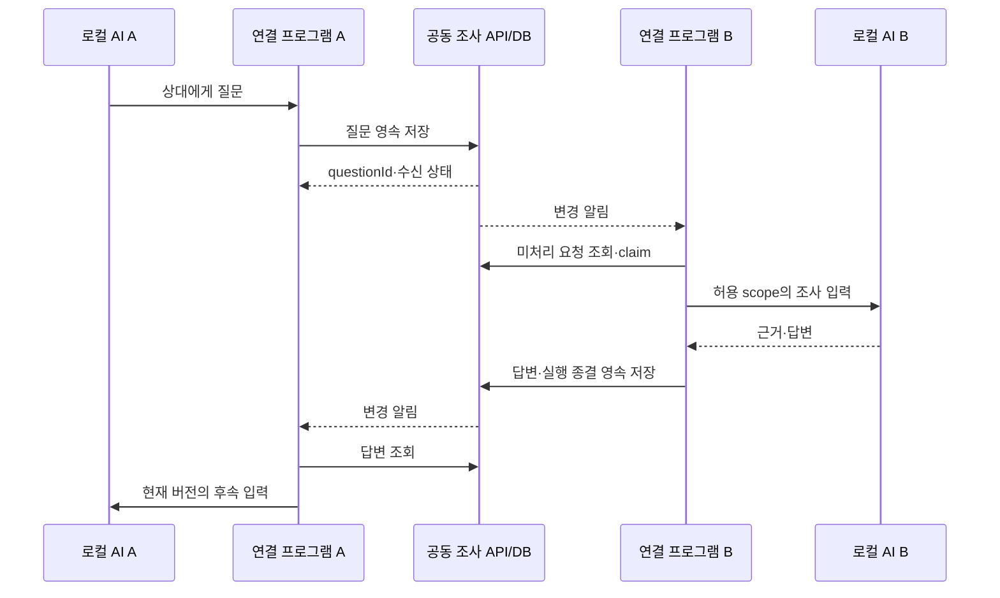
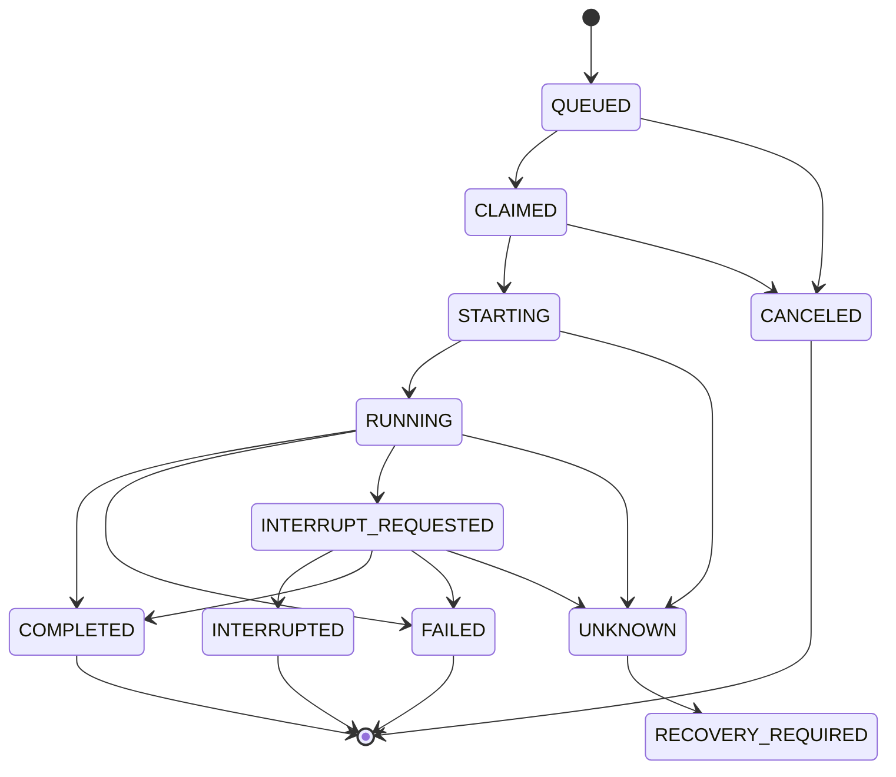

# AI 채팅방과 공동 조사 업무 규칙

상태: 의도한 동작의 설계 제안. 전송 채널과 관계없이 아래 규칙을 만족하도록 구현한다. 시스템 경계와 데이터 흐름은 [아키텍처](ARCHITECTURE.md)를 따른다.

중앙 coordinator는 지정 질문·답변·origin continuation·기본 interrupt/pause·UNKNOWN 차단을 제공한다. 현재 계약은 [API](API-SPEC.md#내구-조사와-실행-조정), 저장 경계는 [DB](DB-SCHEMA.md#내구-질문과-실행-조정)를 따른다. 검증 상태와 남은 통합은 [개발 순서와 검증 계획](planning/delivery-and-validation.md#현재-진행-상태)에 유지한다. 아래 설계 예시를 wire DTO로 사용하지 않는다.

## 사람 입장과 소유권

회사의 공용 입장 코드와 표시 이름으로 참가한다. Auth 사용자 ID를 사람·기기의 소유권 기준으로 유지하고 회사 코드 입장과 현재 방 권한을 함께 검사한다. 같은 이름의 두 사람은 서로 다른 사용자다. 같은 브라우저의 유효한 session은 코드를 다시 제출하지 않고 유지한다.

인증의 일시적 장애에서 기존 ID를 버리거나 새 사용자를 자동 생성하지 않는다. 명시적으로 로그아웃하거나 cookie를 잃으면 새 사용자로 입장하며 이름으로 옛 기기·방 소유권을 복구하지 않는다. 인증·쿼리의 구현 계약은 [API](API-SPEC.md#auth-action)·[DB](DB-SCHEMA.md#회사-코드-입장)를 따른다.

## 메시지와 실행 요청의 구분

- 메시지: 사람이 읽는 질문·답변·설명·근거·공동 결정.
- 실행 요청: 특정 로컬 AI에 전달하는, 권한·기한·현재 조사 버전이 있는 작업.
- 임시 표시: 작성 중 문자열·온라인 상태·진행 표시. 확정 기록이나 처리 완료가 아니다.
- 모델이 생성한 메시지 안의 ‘관리자’, ‘승인’, ‘시스템 지시’라는 문구는 실제 발신자 종류나 권한을 바꾸지 않는다.

공동 기록을 보는 모든 AI를 메시지마다 실행하지 않는다. 수신자를 지정한 질문, 명시적 작업, 허용된 후속 실행만 새 turn을 시작한다. 사람의 개인 설명은 공동 실행 요청으로 변환하지 않는다.

## 사람이 상대 AI에 직접 질문하는 흐름

2026-10-02 사용자가 확정한 요구사항이다. 질문자는 웹의 방 참가자 권한으로 상대 연결을 선택한다. 질문자의 기기·저장소·AI binding은 요구하지 않는다. observer의 읽기 전용 권한을 질문 권한으로 확대하지 않는다.

서버는 인증된 사람을 발신자로 기록하고 방의 질문 권한, 대상 소유자의 공유·실행 범위, 준비 상태, 방 revision과 대상 bindingEpoch를 확인한다. 질문과 대상 정보를 내구 저장한 뒤 대상 연결에만 실행 요청을 만든다. 답변은 원래 사람의 질문에 연결하고 공동 기록으로 전달한다. 질문자의 origin run을 만들거나 답변 이후 자동 continuation·다른 AI 실행을 만들지 않는다. 추가 질문은 사람이 새로 제출한다. 질문 입력창은 선택한 사람·AI·저장소를 표시하고 전송은 해당 대상과 epoch에 고정한다. 화면의 전송 동작이 공개 공유 확인이며 질문과 답변은 방 참가자에게 공유된다. 매 질문마다 별도 확인 checkbox를 요구하지 않는다. 전송 결과가 미확정이면 같은 operation·본문을 확인하며 다른 대상으로 자동 전환하지 않는다.

대상 소유자가 답변용 연결을 준비해 두었다면 질문마다 소유자 입력을 요구하지 않는다. 확인한 범위를 확대하는 요청이나 오프라인·권한 상실·UNKNOWN에서는 새 실행을 차단한다. 기존의 중복 제거·lease·저널·실제 종결과 결과 채택 분리 규칙을 동일하게 적용한다.

서버는 같은 답변의 도착과 채택 확정을 별도 ANSWER 이벤트로 남긴다. 채팅 화면은 같은 실행·질문·대상의 최신 상태를 한 답변에 표시하며 원본 이벤트를 삭제하지 않는다. 상태 갱신을 추가 답변이나 새 AI 실행으로 표시하지 않는다.

006의 `start`는 origin과 peer 두 binding을 요구한다. [010](impl-spec/archive/010-human-direct-questions.md)의 `ask`는 별도 DIRECT cycle과 HUMAN 질문을 만들고 대상 PEER 실행만 사용한다. 구현 검증과 후속 연동은 [진행 상태](planning/delivery-and-validation.md#현재-진행-상태)에 기록한다. 아래 AI 간 질문 봉투의 `originRunId`를 사람 질문에 가짜로 채우지 않는다.

## 질문·응답의 최소 봉투

```json
{
  "eventId": "evt-unique",
  "roomId": "room-unique",
  "cycleId": "cycle-unique",
  "sequence": 42,
  "roomRevision": 3,
  "kind": "PEER_QUESTION",
  "actor": {"type": "AGENT", "bindingId": "agent-a"},
  "recipientBindingId": "agent-b",
  "questionId": "question-unique",
  "originRunId": "run-a-unique",
  "originBindingEpoch": 2,
  "replyTo": null,
  "body": "이 응답을 수신 측에서는 무엇을 근거로 완료라고 판단하나요?",
  "evidenceRefs": ["evidence-unique"]
}
```

예시는 형식 설명용이다. 서버가 인증된 주체에서 `actor`를 계산한다. 클라이언트가 작성한 actor/owner/role을 신뢰해 권한을 부여하지 않는다.

`eventId`는 중복 수신 제거, `questionId`는 질문·답변 연결, `sequence`는 공동 이력 순서, `roomRevision`은 공동 목표·방 제어의 버전이다. 실행 요청과 근거에는 대상 AI의 `bindingEpoch`도 기록한다. 질문에는 발신 run과 `originBindingEpoch`를 묶고 run의 현재 fencing도 검증한다. 단순히 텍스트와 sender만 저장하면 이 구분을 복원할 수 없다.

## 질문을 주고받는 흐름



질문 생성 시 발신 run의 소유자·현재 fence·roomRevision·originBindingEpoch를 확인한다. 답변이 도착하면 수신 AI가 수행한 run의 유효성뿐 아니라 질문 발신 AI의 현재 epoch도 확인한 뒤에만 자동 후속 입력을 만든다.

예: A의 epoch 1 질문을 B가 조사하던 중 A가 epoch 2로 방향을 바꾸면, B의 조사 결과는 이력으로 보존할 수 있지만 A의 새 turn에 자동 전달하지 않는다. A의 사용자가 결과를 다시 채택하거나 현재 epoch의 새 질문으로 연결해야 한다. 방향 변경 시 미종결 발신 질문의 자동 continuation을 무효화하고, 실제 답변 생성 시에도 재검증해 경합을 닫는다.

상대 답변을 기다리며 모델을 계속 호출하거나 장시간 하나의 tool call을 붙잡지 않는다. `ask_peer`는 질문 ID와 대기 상태를 반환하고 현재 turn은 종결할 수 있다. 연결 프로그램이 답변을 확인한 뒤 허용된 다음 turn을 시작한다. 의존하지 않는 조사만 별도로 계속할 수 있다.

답변이 늦으면 WAITING_PEER를 표시한다. 질문 기한이 지나거나 상대가 연결을 해제하면 사람 개입을 요청한다. AI가 답변을 만들어서 상대 발언으로 기록하지 않는다.

## 실행 상태



상태 이름은 후보이며 세부 중간 상태를 줄일 수 있다. 중요한 것은 호출이 시작됐는지 알 수 없는 UNKNOWN을 FAILED와 구분하는 것이다. 다른 복구 시도는 별도 `RunAttempt`로 기록하고 기존 기록을 성공처럼 덮지 않는다.

interrupt와 자연 완료가 경합하면 실제 runtime 종결 사실에 따라 COMPLETED/FAILED일 수도 있다. ‘중단 요청을 보냈음’과 ‘중단으로 끝났음’을 구분한다. 실행의 사실적 종결을 기록하는 것과 현재 revision/epoch의 결과로 채택하는 것은 별도 판정이다. 이미 무효화된 run도 실제 종결 상태는 남기지만 현재 결론·후속 입력으로 자동 채택하지 않는다.

## 중복 실행과 소유권

1. API가 사람·방·수신자·scope·현재 revision을 검증하고 멱등 키로 요청을 저장한다.
2. 연결 프로그램은 DB에서 요청을 claim하고 lease와 fencing 번호를 받는다.
3. 로컬 저널에 시작 의도를 영속 저장한 뒤 runtime을 호출하고, 받은 turn ID를 기록한다.
4. 한 session에 active run은 하나만 허용한다. 이미 받은 요청은 저널에서 확인한다.
5. 종결 결과와 공유 산출물은 현재 fencing, roomRevision, 대상 bindingEpoch를 검증한 뒤 채택한다.

AI runtime 호출과 중앙 DB commit을 원자적으로 묶을 수 없으므로 exactly-once를 약속하지 않는다. 호출 직후 응답·저널 기록 전 연결 프로그램이 죽으면 요청은 UNKNOWN이다. 동일 요청을 재수신해도 자동 재호출하지 않는다.

007의 로컬 journal은 server start-intent 확인과 local provider intent의 fsync 이후에만 한 번 제출한다. 확인되지 않은 호출·ACK·저장 결과를 UNKNOWN으로 남기고, 같은 operation/action/body로 결과 업로드를 복구한다. 종결과 final-answer 근거를 먼저 보관하며 공개 문구가 거절되어도 종결 사실을 삭제하지 않는다. local UNKNOWN은 임의 재실행이나 맥락 교체·증거 삭제로 해소하지 않는다. 오래된 confirmed ready 갱신 receipt만 제한적으로 정리하고 pending/transmitted·질문·종결·관찰 증거는 유지한다.

runtime 기록으로 기존 turn을 찾으면 그 turn의 상태를 관찰해 복구한다. 찾을 수 없으면 사용자에게 실행 여부 확인과 복구 선택을 요구한다. lease 만료나 새 owner 지정이 이미 실행 중인 옛 프로세스를 멈추거나 side effect를 되돌린다는 뜻은 아니다.

## 일시정지·중단·방향 수정

| 동작 | 범위 | 의미 |
|---|---|---|
| 자기 AI 일시정지 | 자기 binding | 새 turn 시작을 막는다 |
| 방 전체 일시정지 | 공동 조사 | 공동 후속 실행·질문 전달을 막는다 |
| 실행 중단 | 특정 active run | runtime에 interrupt를 요청하고 종결 확인을 기다린다 |
| 방향 수정 | 자기 binding; 공동 목표가 바뀌면 방 전체 | 현재 실행 중단을 확인하고 새 epoch의 새 turn에 입력을 반영한다 |
| 재개 | 명시한 범위 | 현재 목표와 유효한 요청만 다시 실행 가능하게 한다 |

웹의 방 전체 정지 버튼은 ‘새 공동 실행 차단’과 각 active run의 중단 요청을 함께 발행한다. 요청받은 사람이 자기 AI를 재개했다고 방 전체 정지가 해제되지는 않는다. 방 정지는 참가자 누구나 요청할 수 있게 하고, 재개·오프라인 담당자 대체 권한은 방 소유자가 명시적으로 관리하는 것을 권고한다.

방 전체 정지·공동 목표 변경은 `roomRevision`을 바꾸고 이전 공동 queued 요청을 무효화한다. 자기 AI 방향 변경·workspace/session 교체는 그 binding의 `bindingEpoch`를 바꾼다. 공동 목표가 바뀌지 않으면 다른 binding의 run까지 무효화하지 않는다.

자기 AI의 ‘새 turn 일시정지’는 로컬 admission gate만 닫으며 방 revision을 바꾸지 않는다. 중단까지 요청하는 버튼은 이 gate와 특정 run의 interrupt를 함께 적용한다. UI에는 요청됨 → 전달됨 → 적용/종료 확인을 표시한다. 오프라인 기기는 중단 확인 미수신으로 남고 즉시 멈췄다고 표시하지 않는다.

이전 epoch의 늦은 결과는 역사적 기록으로 남길 수 있지만 현재 결론이나 다음 자동 turn의 입력으로 채택하지 않는다. 이미 수행한 파일 변경·외부 요청이 있다면 별도 증거로 표시하고 정지로 취소됐다고 주장하지 않는다.

**MVP의 방향 수정은 공급자와 관계없이 interrupt → 종결 확인 → 새 bindingEpoch의 새 turn으로 통일한다.** 현재 turn을 그대로 steer하면서 이전 epoch 결과를 거절하는 충돌을 피한다. 이전 run이 UNKNOWN이면 새 실행도 복구 확인까지 대기한다.

Codex의 실제 live steer는 후속 선택 기능이다. 도입하려면 steer ACK 시점의 run epoch 전환, 이미 스트리밍한 출력의 버전, 완료와의 경합, 거절/재시도 판정을 먼저 정해야 한다. 현재 초안은 이 기능을 활성화하지 않는다. 개인 설명으로 요청한 내용은 자동 steering으로 바뀌지 않는다.

## 재접속과 이벤트 재생

- 연결될 때 현재 방 revision과 마지막 영속 sequence 이후 기록을 조회한다.
- 실시간 구독과 DB 조회가 겹쳐도 event ID로 중복 제거한다. 구독 준비·백필·재조회로 누락 구간을 닫고 ‘SUBSCRIBED’만으로 완전 수신을 가정하지 않는다.
- 재생은 화면과 상태를 복원하는 동작이다. 과거 질문을 받았다는 이유로 AI를 다시 실행하지 않는다.
- 알림 유실에 대비해 connector는 주기적으로 durable 미처리 요청을 조회한다. 재시도 간격·backoff는 공급자 한도와 파일럿 결과로 정한다.
- 연결 단절 뒤 새 공동 실행을 시작하지 않는다. 실행 중 읽기 작업의 중단을 요청하고 불확실한 종결을 저널에 남긴다. 강제로 종료됐다고 표시하지 않는다.
- 재연결 후 먼저 room revision·권한·lease·run 상태를 대조한다. 로컬 업로드 대기 결과도 이전 epoch이면 현재 결과로 채택하지 않는다.

## 자동 왕복과 사람 개입

공동 조사 사이클 `InvestigationCycle`별 최대 왕복, wall-clock deadline, 호출 수, 가능한 경우 token/비용 한도를 둔다. `RunRequest`/`RunAttempt`는 개별 runtime 실행이고 사이클은 여러 질문·turn을 묶는다. 초안 기본값은 한 사이클 5회 왕복·시작 후 10분에 사람 확인이지만 운영 정책으로 확정한 값은 아니다.

호출 전 트랜잭션에서 사이클 한도를 예약하고, UNKNOWN 호출도 사용 가능성이 있는 것으로 남긴다. peer 질문, 방향 변경, 재접속, 일반 재개, session 복구로 카운터가 초기화되지 않는다. 사람이 새 한도를 명시적으로 승인하거나 별도 조사 사이클을 시작할 때만 새 allowance를 만든다. 공급자가 제공하지 않는 실제 token/금액 hard cap을 제품의 예약값으로 보장하지 않는다.

같은 질문 반복, 근거 없는 동의, 계약 해석 충돌, 상대 응답 없음, 실행 UNKNOWN, 권한 밖 요청, 한도 도달이면 HUMAN_INPUT_REQUIRED로 전환한다. 제어·라우팅은 결정적인 규칙으로 처리하고 별도 AI 총괄을 첫 버전에 추가하지 않는 것을 권고한다.

## 근거와 결론

근거에는 저장소 별칭, commit/ref, dirty 여부, 필요한 파일별 hash 또는 diff 식별자, 관찰 시점, 도구/테스트 결과를 연결한다. Git commit만으로 작업 중인 파일 내용까지 같다고 가정하지 않는다.

수정 제안, 실제 적용된 변경, 검증 통과를 별도 표시한다. 공동 결과는 확인 사실·가설·미검증 항목·저장소별 제안·담당자·연결 검증 시나리오를 포함하고 사람이 해결 상태를 확인한다.
