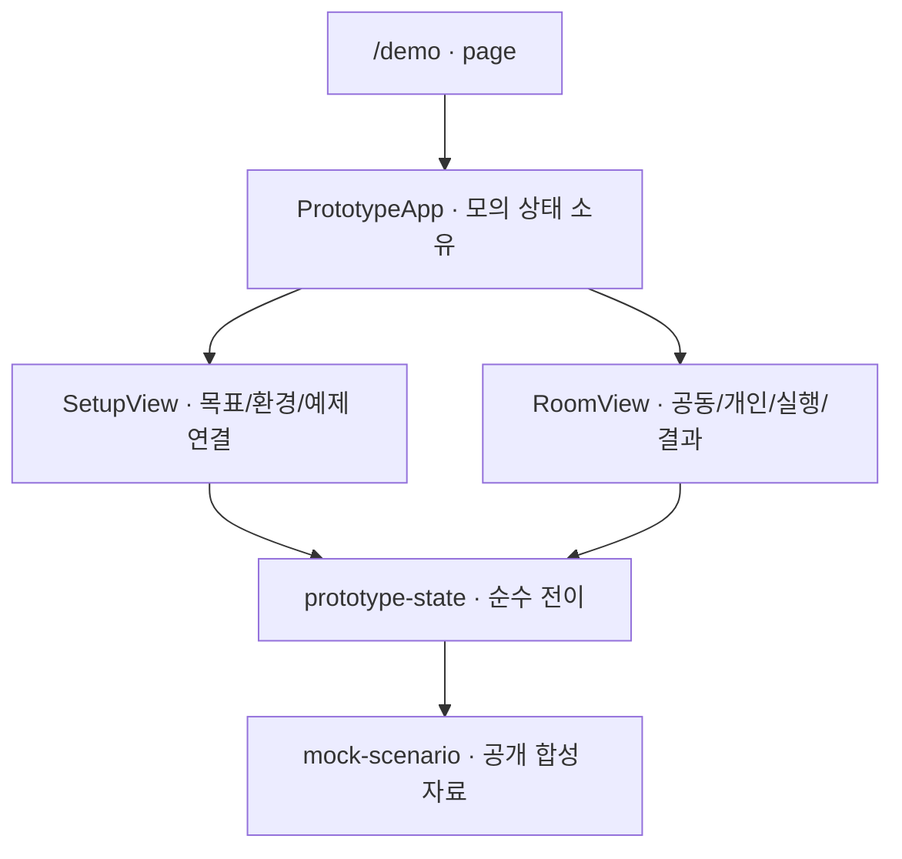

# 프런트엔드 구조

2026-10-05의 Git 기준 소스와 작업트리를 확인했다. 웹은 Next.js 16.3.7 App Router·React 19.3.0·TypeScript와 Tailwind 4.3.3·shadcn/ui 구성 요소를 사용한다. 모의 체험과 실제 사람 인증·방 접근·기기 관리·공동 기록 polling 화면이 있다. 진행 상태·검증 수치·남은 통합은 [개발 순서와 검증 계획](planning/delivery-and-validation.md#현재-진행-상태)에 유지한다.

## 화면과 모듈 경계

[page.tsx](../src/app/page.tsx)의 `/`는 실제 입장 상태에 따라 `/app` 또는 `/login`으로 보낸다. 모의 체험 [PrototypeApp](../src/features/investigation-prototype/prototype-app.tsx)은 `/demo`에서 제공한다. [layout.tsx](../src/app/layout.tsx)가 한국어 문서 언어·metadata와 공통 CSS를 제공한다.

`/login`의 `LoginForm`은 회사 입장 코드·표시 이름을 입력받고 제출 직후 코드 입력을 비운다. `/app`의 `AccessDashboard`는 채팅방 목록과 이름만 받는 새 방 Dialog·초대 참가를, `/app/rooms/[roomId]`의 `RoomAccessView`는 채팅과 별도 관리 Dialog를 제공한다. 목표·관찰·환경은 채팅 진입의 필수 입력이 아니다. 이름에서 실제 관찰을 만들어 내지 않고 고정 기본값을 사용한다. 서버 page는 요청별 Supabase client로 현재 Auth 사용자와 RLS 결과를 조회한다. 화면 입력은 고정 POST action으로 전달하며 권한 판정을 브라우저 상태에 맡기지 않는다. [API 계약](API-SPEC.md)과 [데이터 모델](DB-SCHEMA.md)을 따른다.

실제 인증 화면은 `src/features/room-access/`에 있고 기존 prototype reducer를 import하지 않는다. Auth/접근 API와 Next proxy는 `src/lib/supabase/`의 요청별 cookie client를 사용한다.

채팅의 원본 이벤트는 append-only 이력에 보존한다. 같은 방·request·question·agent·bindingEpoch의 ANSWER 상태 변경은 `chat-presentation.timelineEvents`에서 가장 큰 sequence를 선택해 한 답변으로 표시한다. 서로 다른 실행과 식별 정보가 부족한 이벤트는 합치지 않는다. 이 표시는 서버 이력·요청·실행 횟수를 바꾸지 않는다.

`/app/connections`의 [ConnectionManager](../src/features/device-binding/connection-manager.tsx)는 자기 참가 방 선택·연결 코드 승인·기기 취소/제거와 최근 수신·만료를 표시한다. 방의 [RoomBindings](../src/features/device-binding/room-bindings.tsx)는 공개 저장소/session 별칭·Git metadata·runtime·epoch·미검증 상태만 보여 주며 observer도 읽을 수 있다. 기기 credential·proof·절대 경로·native locator는 props/HTML/RSC에 포함하지 않는다. heartbeat와 등록을 AI 실행 가능으로 표시하지 않는다.

- [prototype-app.tsx](../src/features/investigation-prototype/prototype-app.tsx)는 `useReducer`로 화면 수명을 소유하고 지속적인 모의 안내와 짧은 접근성 상태 알림을 제공한다. 새로고침하면 초기화된다.
- [prototype-state.ts](../src/features/investigation-prototype/prototype-state.ts)는 입력 검증·공개/개인 action·정지 집계·사람 판단을 처리한다. presentation state이며 서버 권한이나 API 계약이 아니다.
- [setup-view.tsx](../src/features/investigation-prototype/setup-view.tsx)는 일반적인 목표·현상·기대 동작·환경·공유 범위와 예제 연결을 입력받는다. 실제 PC 경로나 공급자 비밀 입력은 없다.
- [room-view.tsx](../src/features/investigation-prototype/room-view.tsx)의 내부 컴포넌트는 공동 기록·발신 초안·개인 입력·각 실행 확인·결과를 표시한다. 외부 공개 컴포넌트 표면은 `RoomView`로 유지한다.
- [mock-scenario.ts](../src/features/investigation-prototype/mock-scenario.ts)는 결정적 예제만 제공한다. 버튼으로 이벤트를 재생하며 실제 AI 호출·자연 종결을 흉내 내는 background timer는 없다.

## 상태 소유권과 입력

실제 방은 [InvestigationView](../src/features/investigation-coordinator/investigation-view.tsx)의 공개 이력을 함께 렌더링한다. [history-state](../src/features/investigation-coordinator/history-state.ts)는 eventId 중복 제거·sequence gap 복구와 typed 과거 run 재생을 담당한다. 방 전환·권한 거절 시 이력을 초기화하고 늦게 도착한 snapshot이 최신 상태를 되돌리지 않도록 처리한다. 이 상태는 prototype reducer와 분리한다.

조사 화면의 내부 책임은 다음 모듈로 나눈다. 조회·요청 전송·저장/삭제·대상 선택과 React 상태의 소유자는 화면 하나로 유지한다.

| 모듈 | 책임 |
|---|---|
| [investigation-view.tsx](../src/features/investigation-coordinator/investigation-view.tsx) | 화면 수명, 조회와 mutation 취소, 미확정 요청 저장/삭제, 이력과 대상 선택 |
| [investigation-client.ts](../src/features/investigation-coordinator/investigation-client.ts) | `callInvestigation` 함수 하나로 요청 검증·fetch·응답 읽기·오류 전달 |
| [direct-intents.ts](../src/features/investigation-coordinator/direct-intents.ts) | 사용자·방 저장 키, 복원 검증, 새 요청과 동일 재시도 본문 생성 |
| [chat-presentation.ts](../src/features/investigation-coordinator/chat-presentation.ts) | 연결 상태와 저장된 질문 대상의 현재 metadata 대조 |
| [chat-timeline.tsx](../src/features/investigation-coordinator/chat-timeline.tsx) | 메시지·질문/답변 연결·당시 저장소 미확인·이전 이력 스크롤과 새 메시지 표시 |
| [chat-composer.tsx](../src/features/investigation-coordinator/chat-composer.tsx) | 질문 대상·입력·공개 안내·전송·한글 조합·포커스 표시 |
| [advanced-controls.tsx](../src/features/investigation-coordinator/advanced-controls.tsx) | 명시적으로 펼친 공동 조사와 중단·재개 제어 |

[ChatShell](../src/features/room-access/chat-shell.tsx)은 채팅방 탐색·모바일 Sheet·참가자 정보 배치만 맡는다. HTTP·저장·polling과 권한 상태를 복제하지 않는다. shadcn/ui의 기본 요소는 `src/components/ui/`에 둔다.

브라우저 HTTP 모듈은 요청을 검증한 뒤 POST JSON을 전송한다. 호출자 중단과 10초 제한을 결합하고 응답의 실제 수신 바이트를 최대 262,144바이트로 제한한다. JSON content type, 엄격한 UTF-8과 기존 BOM 처리, 오류 우선순위 및 reader 정리를 유지한다. 서버의 16KiB 요청 읽기 모듈과 실행 환경·상한이 다르다. 직접 요청 정책은 저장값의 읽기·거절을 수행하며 저장·삭제와 재시도 시점은 화면이 결정한다.

공동 발언·명시적 origin/peer 조사 시작·자기 interrupt·방 pause·방/조사 재개를 제공한다. 준비와 실행은 기기 보고로 표시하며 provider 미검증·UNKNOWN·과거 미채택을 구분한다. observer는 읽기 화면을 사용한다. polling은 활동/추가 이력 조회 시 2초, idle 10초, 숨김 30초이며 실패 시 최대 30초 backoff를 적용한다. 동시 조회를 제한하고 화면 종료·mutation·권한 거절 때 진행 중 요청을 abort한다.

직접 질문 폼은 질문자의 AI 연결 없이 표시한다. 준비된 상대 연결이 하나면 기본 선택하고 여러 연결이면 명시적으로 선택한다. 선택 목록에는 저장소·세션·소유자 별칭과 runtime을 표시한다. 대상 epoch 교체나 offline 상태를 확인하면 재선택을 요구한다. 입력창의 명시적 전송으로 질문·공개 공유를 제출하고 같은 질문의 답변과 실제 종결 상태를 조회한다. 질문과 답변은 방 참가자에게 공유된다는 안내를 표시한다. 별도의 매 질문 checkbox는 없다. Enter는 전송, Shift+Enter는 줄바꿈이며 한글 조합 중 Enter는 전송하지 않는다. 성공 전송 후 입력이 다시 활성화된 시점에 포커스를 돌리고 polling으로 초안·선택 범위를 지우지 않는다.

공동 조사의 내 AI·상대 AI 선택 목록도 개발자·runtime·공개 저장소 별칭·세션 별칭을 함께 표시한다. 선택 항목의 값은 기존 agent ID이며 같은 참가자의 다른 저장소를 표시할 때도 등록된 공개 정보를 사용한다. 모델·effort의 웹 선택과 적용 상태는 후속 설정 범위다.

응답이 유실된 직접 질문은 sessionStorage에 같은 operation·본문을 보관하고 사용자가 `같은 요청 확인`을 실행하면 그대로 재전달한다. 서버에서 인증한 사용자 ID와 방 ID를 저장 키에 포함하고 복원한 본문의 `expectedUserId`도 대조한다. 예전 방 ID만 있는 항목은 제거하며 새 계정에서 채택하지 않는다. 쿠키만 다른 계정으로 바뀐 이전 화면의 요청도 서버의 실제 Auth 대조에서 거절한다. 화면 종료나 늦은 응답이 다른 사용자의 미확정 기록을 지우지 않도록 처리한다. 새 질문으로 자동 재시도하지 않는다. 직접 질문의 중단 요청은 `canInterrupt`가 허용한 실행 하나만 대상으로 하며 ACK와 typed 종결을 구분한다. 실제 브라우저 검증 범위는 [진행 상태](planning/delivery-and-validation.md#현재-진행-상태)를 따른다.

아래 `shared`·`draft`·`privateHistory`와 개인 설명·방향 수정은 `/demo`의 모의 체험 규칙이다. 실제 개인 설명의 제품 연결은 후속 범위다.

공동 확정 이벤트 `shared`, 미확정 발신 `draft`, 개인 설명 `privateHistory`는 모의 reducer에서 서로 다른 필드다. 개인 기록을 공동 배열에 넣고 CSS로 숨기는 구조가 아니다. 설명·방향 수정·공동 발언의 제품 의미는 [상호작용 정본](guides/interaction-design.md#개발자-입력의-종류)을 따른다.

Composer의 미제출 초안은 컴포넌트 로컬 상태에서 `speak`·`explain`·`steer`별로 보관한다. 개인 설명/방향 수정 전환은 각 초안을 유지하고 제출은 해당 초안만 비운다. 개인 원문을 공개 입력으로 자동 복사하지 않는다. 개인 설명의 공개 전환은 명시적인 별도 action이다.

자기 AI 정지는 A만 대상으로 하며 전체 pause는 A/B의 실제 모의 terminal을 모두 기다린다. requested·acknowledged·unknown·terminal을 구분하고 ACK를 완료로 표시하지 않는다. 예제 observer는 UI와 reducer에서 쓰기를 거절하지만 실제 인증·접근 제어 검증을 대신하지 않는다.

## 표시와 접근성

[globals.css](../src/app/globals.css)는 Tailwind와 실제 웹의 공통 UI 색상·기본 스타일을 제공한다. 실제 채팅은 desktop의 탐색·대화·참가자 정보와 모바일 Sheet를 사용한다. 모의 체험의 기존 CSS는 `prototype.css`에서 `.prototype-demo` 아래로 제한하며 `/login`·실제 채팅으로 돌아왔을 때 화면을 덮어쓰지 않는다. 모의 체험은 desktop 공동/개인 2열과 390px 모바일 탭을 제공한다. 정지·실행 확인은 모바일 탭 밖에서도 접근 가능하다. label·상태 텍스트·focus 스타일을 사용하고 새 로그 전체를 live region에서 반복 읽지 않는다. Enter 제출은 composition 상태에서 차단하고 Shift+Enter는 줄바꿈이다.

## 검사와 남은 통합

웹·단위·브라우저의 타입·lint·빌드와 동작 검사를 수행한다. 현재 검증 수치는 [개발 순서와 검증 계획](planning/delivery-and-validation.md#현재-진행-상태)을 따른다. 개인 미제출 초안 전환의 실패 재현과 보정은 [오류 기록](BUG-FIXES.md#2026-10-01--미제출-개인-입력의-공개-방향-수정-전환)에 남긴다. CSS/layout 변경이 없는 소스 보정에서는 이전 직접 시각 검토를 재사용한다.

웹·단위·브라우저는 각 tsconfig로 타입 검사한다. 독립 `experiments/local-ai-runtime/`은 웹 import/build/lint/test에 포함되지 않는다. 외부 폰트·AI·클라우드 계정 없이 웹 검증을 수행한다.

실제 연동에서는 mock reducer를 서버 정본으로 승격하지 않는다. 모의·Auth·기기 browser는 각각 `playwright.config.ts`, `playwright.auth.config.ts`, `playwright.device.config.ts`로 분리한다. 기기 browser의 parent broker는 자기 합성 pairing·등록·heartbeat만 지원하고 제품/브라우저 child에 admin·DB·JWK를 전달하지 않는다. 민감 artifact 정제와 trace/screenshot/video 비활성 정책을 재사용한다. 각 단계의 진행 상태와 재검사 결과는 개발 순서 문서에서 관리한다.

workflow browser는 `playwright.workflow.config.ts`로 분리하며 parent broker가 자기 fixture의 고정 fake-driver 동작만 제공한다. 실제 runtime 제어와 참가자별 모델/effort·Realtime·개인 설명은 [개발 순서](planning/delivery-and-validation.md#단계별-명세-범위)의 후속 범위다. 현재 등록은 `codex/unverified`이며 모델 선택 기능은 아직 없다. 현재 mock 역할과 상태는 실제 권한 검증의 증거가 아니다.
